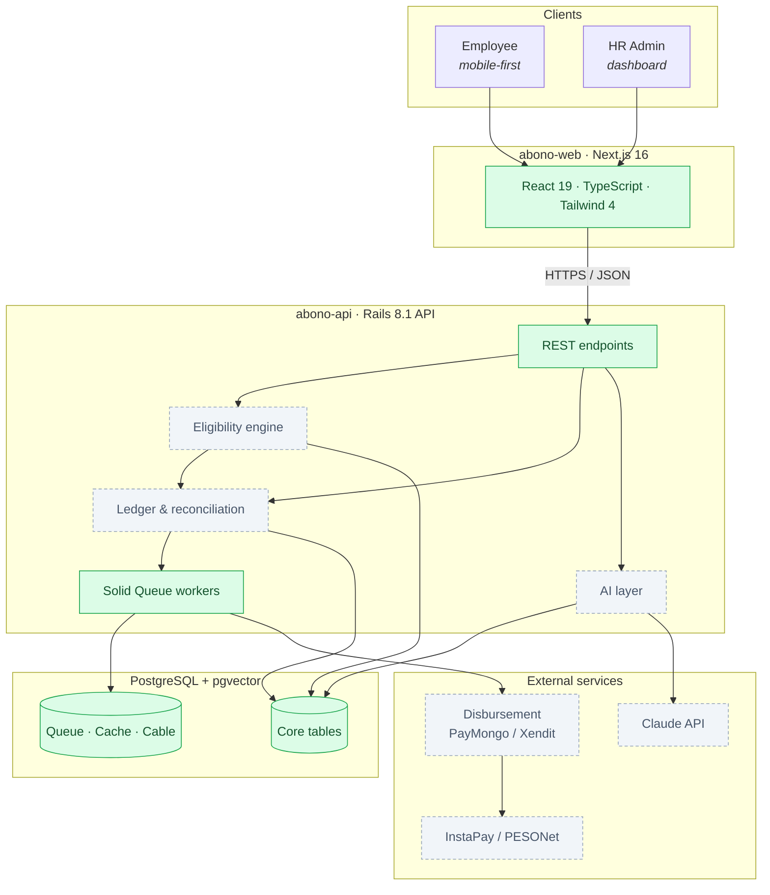
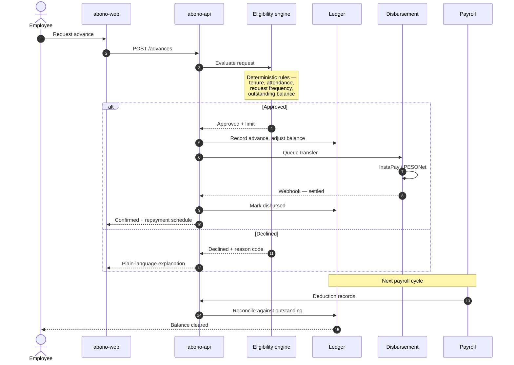
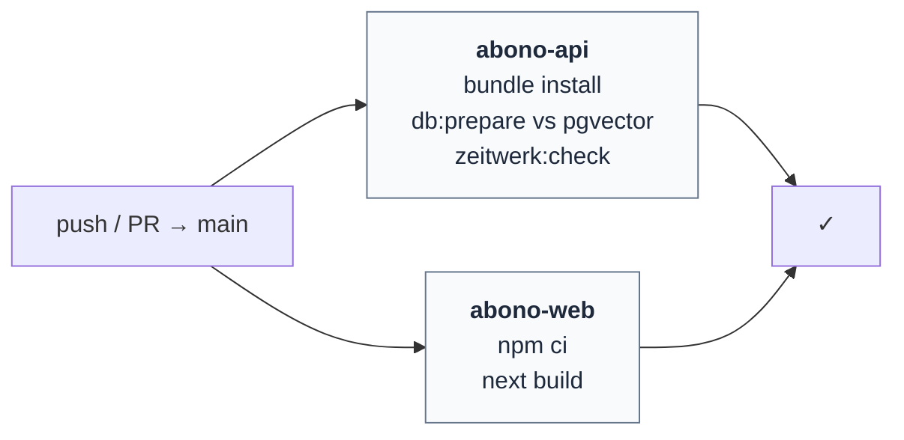

# Abono

**An AI operating system for employer-funded salary advances in the Philippines.**

[](https://github.com/lmagsino/abono/actions/workflows/build.yml)
[](.ruby-version)
[](abono-api/Gemfile)
[](abono-web/package.json)
[](#database)

---

## The problem

Payday in the Philippines is usually twice a month. Expenses are not.

When a medical bill or tuition payment lands mid-cycle, workers reach for the
options within arm's reach: the office lending circle, a `5-6` informal lender
charging 20% flat over weeks, or a salary loan that quietly compounds. Money
already earned — sitting in a payroll system, unpaid only because of a
calendar — ends up costing a month's interest to access early.

Abono makes earned wages reachable before payday. Employers fund the advances,
so there is no third-party lender, no credit check, and no interest charged to
the employee. Repayment happens through the existing payroll deduction the
employer already runs.

The hard problems are not the transfers. They are deciding *who* can borrow
*how much* without pushing anyone into a debt spiral, keeping a ledger that
reconciles cleanly against payroll every cycle, and explaining both to a worker
in language that does not require a finance degree.

> **Abono** — Filipino, from Spanish. To shoulder a cost on someone's behalf,
> with the understanding that it comes back. *"Abonohan mo muna ako."*

---

## Architecture

Two applications, one Postgres, no Redis.



<sub>■ Green — scaffolded and running. ▢ Dashed — designed, not yet built.</sub>

### Why this stack

| Decision | Reasoning |
| --- | --- |
| **Rails 8.1, API-only** | Money movement needs transactional integrity and an auditable ledger far more than it needs a novel runtime. Active Record's transaction and locking semantics are the point. |
| **Postgres for everything** | Solid Queue, Solid Cache and Solid Cable put jobs, cache and websockets in Postgres. One database to back up, one to secure, one to reason about during an incident. **No Redis.** |
| **pgvector in from day one** | The AI layer needs embeddings. Adding the extension during scaffolding costs one migration; retrofitting it into a live financial database costs a maintenance window. |
| **Next.js 16, server-first** | Two audiences with opposite needs — a worker on a mid-range Android phone, an HR admin on a desktop. Server rendering keeps the mobile bundle small without splitting the codebase. |
| **Monorepo** | One person, two deployables, one atomic commit when an API contract changes. |

---

## How an advance works

The full lifecycle, end to end. **This flow is designed, not yet implemented** —
Phase 1 delivers the scaffolding it will run on.



Two things this diagram is quietly insisting on:

- **Eligibility is deterministic, never a model.** Rules a person can read,
  audit, and defend to a regulator. AI explains a decision after the fact; it
  never makes one.
- **A declined request returns a reason code.** "No" without a why is how
  workers lose trust in a system that is meant to be on their side.

---

## Repository layout

```
abono/
├── abono-api/                 Rails 8.1 · API-only
│   ├── app/
│   ├── config/
│   │   ├── database.yml       env-driven, sane local defaults
│   │   ├── cache.yml          Solid Cache
│   │   ├── queue.yml          Solid Queue
│   │   └── cable.yml          Solid Cable
│   ├── db/migrate/            includes pgvector enablement
│   └── bin/jobs               background worker
│
├── abono-web/                 Next.js 16 · TypeScript · Tailwind 4
│   └── src/app/
│       ├── page.tsx
│       └── health/            server-rendered API health check
│
├── .github/workflows/build.yml
└── phased-build-plan.md       full roadmap
```

---

## Getting started

### Requirements

| | Version | Notes |
| --- | --- | --- |
| Ruby | 3.3.11 | pinned in `.ruby-version` |
| Node.js | 22+ | |
| PostgreSQL | 15+ | with [pgvector](https://github.com/pgvector/pgvector) available |

### Database

pgvector must be built against the **same** `pg_config` as your running server.
If Postgres came from a version manager, the Homebrew formula will link against
the wrong installation and the extension will not load:

```sh
git clone --branch v0.8.1 --depth 1 https://github.com/pgvector/pgvector.git
cd pgvector
make PG_CONFIG=$(which pg_config)
make install PG_CONFIG=$(which pg_config)
```

Confirm it resolves:

```sh
psql -U postgres -c "SELECT '[1,2,3]'::vector <-> '[4,5,6]'::vector;"
#  ?column?
# -------------------
#  5.196152422706632
```

### Run it

```sh
git clone git@github.com:lmagsino/abono.git
cd abono
```

**API** — port 3000:

```sh
cd abono-api
bundle install
bin/rails db:prepare      # creates databases, enables pgvector
bin/rails server
```

**Web** — port 3001:

```sh
cd abono-web
npm install
npm run dev
```

### Confirm it works

| Check | Expected |
| --- | --- |
| <http://localhost:3000/up> | `200` — Rails booted cleanly |
| <http://localhost:3001/health> | Both services reported **up** |

`/health` server-renders a live fetch against the API's `/up`, which makes it
the fastest way to confirm the two are actually talking — not just that both
processes started.

---

## Configuration

Each app ships a `.env.example` documenting its variables:

```sh
cp abono-api/.env.example abono-api/.env
cp abono-web/.env.example abono-web/.env.local
```

Defaults assume a stock local Postgres (`postgres` role on `localhost:5432`), so
a fresh clone runs with no configuration at all.

> [!NOTE]
> **Rails does not load `.env` automatically** — no dotenv gem is installed.
> Export the variables or add `dotenv-rails`. Next.js does load `.env.local`.

> [!IMPORTANT]
> Only `.example` files are tracked; real `.env` files are gitignored.
> Production secrets belong in Rails encrypted credentials or a secrets
> manager — never in the repository.

### Background jobs

Solid Queue, Solid Cache and Solid Cable run at the Rails 8 defaults, all
Postgres-backed. Development uses an in-memory cache and an async cable adapter,
so nothing extra needs to be running locally.

```sh
cd abono-api && bin/jobs      # start the worker
```

---

## Continuous integration

`.github/workflows/build.yml` runs on every push and pull request to `main`:



Build-only by design. The API job migrates against a real pgvector-enabled
Postgres, so a broken extension or migration fails CI rather than production.

There is no test suite yet — RSpec and Playwright arrive in Phase 8 and get
their own jobs then.

---

## Roadmap

| Phase | Scope | Status |
| :---: | --- | :---: |
| **1** | Project scaffolding, Postgres + pgvector, CI, health checks | ✅ Complete |
| **2** | Core data model — tenants, employees, advances, ledger, repayments | Planned |
| **3** | Business logic — eligibility engine, ledger, reconciliation | Planned |
| **4** | Disbursement via PayMongo / Xendit sandbox, InstaPay + webhooks | Planned |
| **5** | Employee app and HR dashboard | Planned |
| **6** | AI layer — decision explanations, chat assistant, CSV parsing | Planned |
| **7** | Deployment via Kamal 2, Sentry, OpenTelemetry | Planned |
| **8** | RSpec + Playwright suites, KYB, live credentials, security review | Planned |

Full detail in [`phased-build-plan.md`](phased-build-plan.md).

**Currently at Phase 1.** No live API keys, disbursement integrations or tests
exist yet, by design — multi-tenancy and the ledger are settled before any money
moves.

---

## Design principles

**Deterministic decisions, AI explanations.** Eligibility runs on auditable
rules. The AI layer translates outcomes into plain language and answers
questions — it never approves or declines.

**The ledger is the source of truth.** Every peso disbursed and repaid is a
double-entry record. Reconciliation is a first-class feature, not a monthly
spreadsheet.

**Tenant isolation from the first migration.** Employers see their own workforce
and nothing else. Row-level scoping lands in Phase 2, before any real data does.

**No employee ever pays interest.** Employers fund the float. The moment a
worker pays for access to wages they already earned, this becomes the thing it
was built to replace.

---

## Author

**Leo Magsino Jr.**
[github.com/lmagsino](https://github.com/lmagsino)

Built and maintained solo.
